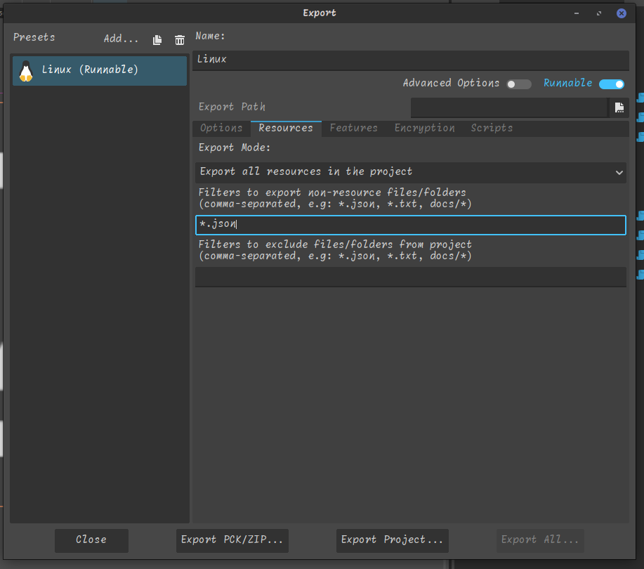

# WIP! Don't use yet!

![github-top-lang][lang] ![lic] ![lic-font]

# Icons Fonts for Godot

**Compatible with Godot 4.x**

This addon allows to easy find, use and recolor popular icons fonts in your Godot project.

## What problems it solves:

- You only needs this addon - as you don't have:
	1. to go online find font
	1. then find icon
	1. check icon licence - and maybe you need to search for another
	1. finally download it

- Better alterative to Godot's build emojis as:
	- to use them you need to find unicode online
	- they don't work on some platforms for example Web
	- they are outdated

## Included Icons Fonts
- [*Templarian's Material-Design-Icons*](https://github.com/templarian/MaterialDesign),
	a collection of icons for the [Material Design](https://material.io/) specification.

- [Google Noto Emojis Color font][noto-emoji]
- [game-icons.net](https://github.com/toddfast/game-icons-net-font)

<!-- todo update to show new nodes and one example of each icons font included-->


<!-- todo add link to docs when they are ready -->

## Nodes and Singleton
<!-- todo add screenshots, and how to use them -->
This addon provides the following nodes to use the icons in Godot:
- **FontIcon**: A node that displays an icon from any font included.
- **FontIconButton**: A node that displays an icon from any font included with label.

**IconsDB** singleton for easier use of icons anywhere in your project.

## In Editor

<!-- todo add paragraph about dock mode by default -->
It's also adds **IconsFinder** to the Godot's **Tools** menu.

<!-- todo update -->


So you can find the icons easily.

<!-- todo update -->


## Using it with RichTextLabel
You can use the icons in RichTextLabel.


***This dosen't work yet!***
```gdscript
@tool
extends RichTextLabel

@export_multiline
var text_with_icons : String:
	set(value):
		text_with_icons = value
		bbcode_enabled = true
		text = IconsDB.parse_icons(value)

	get: return text_with_icons

func _ready():
	bbcode_enabled = true
	text = IconsDB.parse_icons(text_with_icons)
```

## Exporting
For emojis to work in exported projects,
you need add `*.json` files to include files settings:


[lic]: https://img.shields.io/github/license/rakugoteam/Godot-Material-Icons?style=flat-square&label=📃%20License&
[lang]: https://img.shields.io/github/languages/top/rakugoteam/Godot-Material-Icons?style=flat-square
[lic-font]:https://img.shields.io/static/v1.svg?label=📜%20Font%20License&message=Pictogrammers%20Free%20License&color=informational&style=flat-square
[noto-emoji]:https://github.com/googlefonts/noto-emoji/tree/main/png
